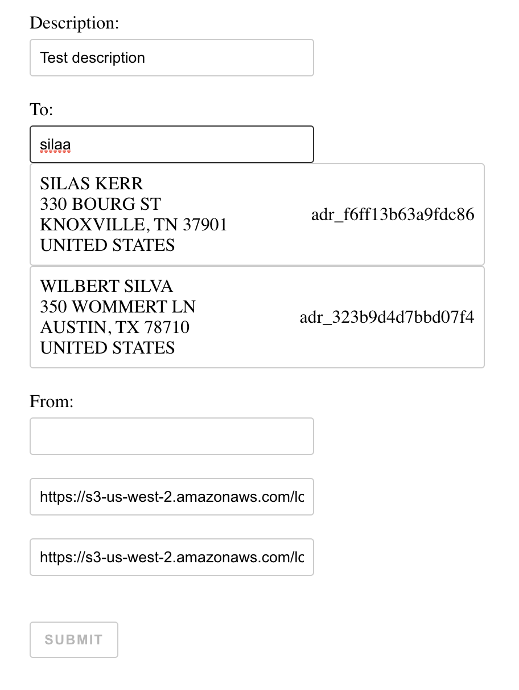

# Access to previously created addresses
This application is built with React and uses Lob API.

Here is a screenshot:

  

## Viewing the app
In the project directory run:
### `npm start`
and open [http://localhost:3000](http://localhost:3000) to view it in the browser.

